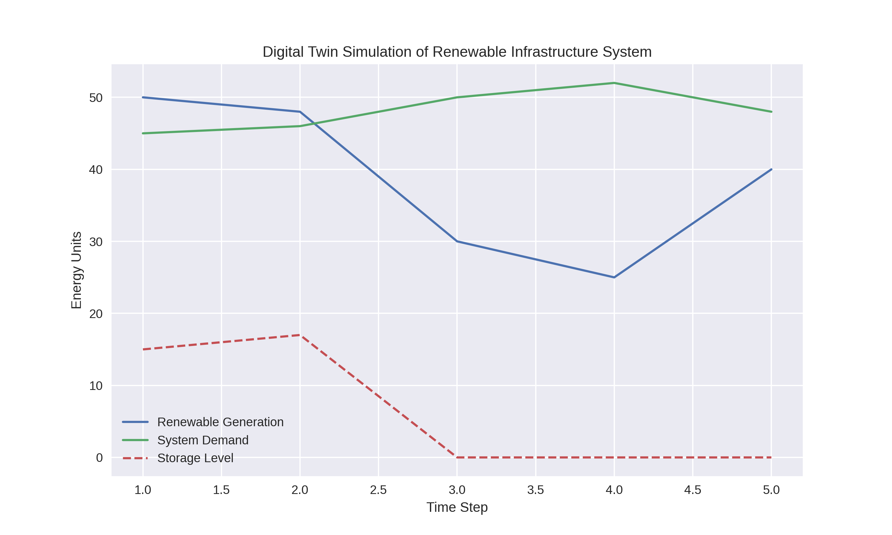

# Digital Twin Prototype for Renewable Infrastructure Resilience

This repository presents a proof-of-concept digital twin prototype designed to explore
renewable energy integration and infrastructure resilience from a system-level perspective.

## Project Overview
The prototype represents a simplified infrastructure system composed of:
- Renewable energy generation (e.g., solar or wind)
- Energy storage
- System demand

The digital twin concept is used to simulate system behaviour under variable renewable
generation and stress conditions, supporting scenario-based resilience analysis.

## Key Features
- Modular system representation
- Scenario-based simulation of renewable variability
- Simple resilience indicators (e.g. mismatch, recovery behaviour)
- Conceptual foundation for digital twin–enabled infrastructure planning

## Structure
- `data/`: Sample input data
- `notebooks/`: Jupyter notebook implementing the prototype
- `outputs/`: Example simulation outputs

## How to Run
1. Install dependencies:
```bash
pip install -r requirements.txt
## Example Output
The figure below shows the simulated behaviour of renewable generation, system demand,
and storage response within the digital twin prototype.


